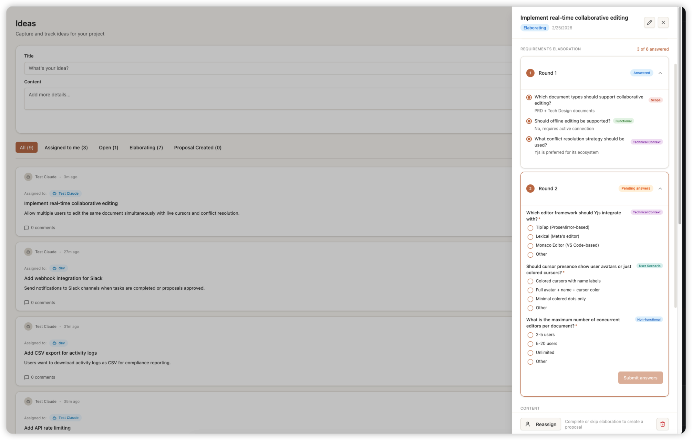

<p align="center">
  
</p>

<p align="center"><strong>AI Agent & Human Collaboration Platform</strong></p>

<p align="center">
  <a href="https://discord.gg/SwcCMaMmR">
    
  </a>
</p>

<p align="center"><a href="README.zh.md">中文</a></p>

Chorus implements the **AI-DLC (AI-Driven Development Lifecycle)** methodology, enabling multiple AI Agents (PM, Developer, Admin) and humans to collaborate on a shared platform through the full workflow from requirements to delivery.

Core philosophy: **Reversed Conversation** — AI proposes, humans verify.

---

## Table of Contents

- [AI-DLC Workflow](#ai-dlc-workflow)
- [Screenshots](#screenshots)
- [Features](#features)
- [Architecture](#architecture)
- [Tech Stack](#tech-stack)
- [Getting Started](#getting-started)
- [Skill Documentation](#skill-documentation)
- [Progress](#progress)
- [Documentation](#documentation)
- [License](#license)

## AI-DLC Workflow

```
Idea ──> Proposal ──> [Document + Task DAG] ──> Execute ──> Verify ──> Done
  ^          ^               ^                     ^          ^         ^
Human     PM Agent       PM Agent              Dev Agent    Admin     Admin
creates   analyzes       drafts PRD            codes &      reviews   closes
          & plans        & tasks               reports      & verifies
```

Three Agent roles:

| Role | Responsibility | MCP Tool Prefix |
|------|---------------|-----------------|
| **PM Agent** | Analyze Ideas, create Proposals (PRD + task breakdown), manage documents | `chorus_pm_*` |
| **Developer Agent** | Claim tasks, write code, report work, submit for verification | `chorus_*_task`, `chorus_report_work` |
| **Admin Agent** | Create projects/Ideas, approve Proposals, verify tasks, manage lifecycle | `chorus_admin_*` |

All roles share read-only and collaboration tools (`chorus_get_*`, `chorus_checkin`, `chorus_add_comment`, etc.).

---

## Screenshots

### Pixel Workspace — Real-time Agent Status


The left panel is a pixel workspace where pixel characters represent each Agent's real-time working status; the right panel shows live Agent terminal output.

### Kanban — Real-time Task Flow


The Kanban board updates automatically as Agents work, with task cards flowing between To Do → In Progress → To Verify in real time.

### Task DAG — Dependency Visualization


A directed acyclic graph showing task dependencies, clearly presenting execution order and parallel paths.

### Proposal — AI Plan Review Panel


Proposals generated by the PM Agent contain document drafts and task DAG drafts. Admins review and approve or reject on this panel.

### Requirements Elaboration — Structured Q&A



PM Agents clarify requirements through structured Q&A rounds before creating Proposals. The panel shows completed rounds with answers and pending follow-up questions for the stakeholder to answer.

### Task Tracking — Details & Activity


The task detail panel integrates activity stream, comments, and dependencies, providing a complete record of each task's execution.

---

## Features

### Kanban & Task DAG

Tasks support dependency relationships (DAG). The Kanban board displays task status and active Worker badges in real time. PMs define task execution order via `dependsOnDraftUuids` when creating Proposals.

### Session Observability

Each Developer Agent creates a Session and checks in to tasks. The UI shows which Agent is working on which task in real time:
- Kanban cards display Worker badges
- Task detail panel shows active Workers
- Settings page manages Agents and Sessions

### Multi-Agent Collaboration (Swarm Mode)

Supports Claude Code Agent Teams for parallel multi-Agent execution. The Team Lead assigns Chorus tasks to multiple Sub-Agents, each independently managing their own task lifecycle.

### Chorus Plugin for Claude Code

The Claude Code plugin automates Session lifecycle management:
- **SubagentStart** — Automatically creates a Chorus Session
- **TeammateIdle** — Automatically sends heartbeats
- **SubagentStop** — Automatically checks out tasks + closes Session + discovers newly unblocked tasks

### Requirements Elaboration

PM Agents clarify requirements through structured Q&A rounds before creating Proposals. Questions are categorized (functional, scope, technical, etc.) with multiple-choice options. Humans answer in CC terminal or on the Web UI. Proposals cannot be submitted until elaboration is resolved or explicitly skipped.

### Proposal Approval Flow

The PM Agent creates a Proposal (containing document drafts and task drafts). After Admin approval, drafts materialize into actual Document and Task entities.

### Notification System

In-app notifications with real-time SSE delivery and Redis Pub/Sub for cross-instance propagation:
- **10 notification types** — task assigned/verified/reopened, proposal approved/rejected, comment added, etc.
- **Per-user preferences** — toggle each notification type on/off
- **MCP tools** — `chorus_get_notifications`, `chorus_mark_notification_read` for Agent access
- **Redis Pub/Sub** — optional, enables SSE events across multiple ECS instances (ElastiCache Serverless)

### Activity Stream

Records all participant actions with Session attribution (AgentName / SessionName format), providing complete work audit trails.

---

## Architecture

```
┌─────────────────────────────────────────────────────────────┐
│                    Next.js App (:3000)                       │
│                                                             │
│  ┌───────────────────────────────────────────────────────┐  │
│  │  Web UI (React 19 + Tailwind + shadcn/ui)             │  │
│  │  Dashboard │ Kanban │ Documents │ Proposals            │  │
│  │  Task DAG  │ Activity │ Settings │ Agent Sessions     │  │
│  └───────────────────────────────────────────────────────┘  │
│                                                             │
│  ┌───────────────────────────────────────────────────────┐  │
│  │  API Layer                                            │  │
│  │    /api/*    - REST API (Web UI)                      │  │
│  │    /api/mcp  - MCP HTTP Streamable Transport (Agent)  │  │
│  └───────────────────────────────────────────────────────┘  │
│                                                             │
│  ┌───────────────────────────────────────────────────────┐  │
│  │  Service Layer (src/services/*.service.ts)            │  │
│  │    Business logic, UUID-first, multi-tenant           │  │
│  └───────────────────────────────────────────────────────┘  │
└─────────────────────────────────────────────────────────────┘
     ↑              ↑              ↑              ↑
  PM Agent    Developer Agent  Admin Agent     Web UI
 (MCP Tools)   (MCP Tools)   (MCP Tools)    (REST API)
                     │
          ┌──────────▼──────────┐   ┌─────────────────────┐
          │  PostgreSQL + Prisma │   │  Redis (optional)   │
          └─────────────────────┘   │  Pub/Sub for SSE    │
                                    └─────────────────────┘
```

## Tech Stack

| Component | Technology |
|-----------|-----------|
| Framework | Next.js 15 (App Router, Turbopack) |
| Language | TypeScript 5 (strict mode) |
| Frontend | React 19, Tailwind CSS 4, shadcn/ui (Radix UI) |
| ORM | Prisma 7 |
| Database | PostgreSQL 16 |
| Cache/Pub-Sub | Redis 7 (ioredis) — optional, ElastiCache Serverless in production |
| Agent Integration | MCP SDK 1.26 (HTTP Streamable Transport) |
| Auth | OIDC + PKCE (users) / API Key `cho_` prefix (agents) / SuperAdmin |
| i18n | next-intl (en, zh) |
| Package Manager | pnpm 9.15 |
| Deployment | [Docker Hub](https://hub.docker.com/repository/docker/chorusaidlc/chorus-app/general) / Docker Compose / AWS CDK |

---

## Getting Started

### Quick Start with Docker (Recommended)

The fastest way to run Chorus — no build tools required:

**1. Clone the repository**

```bash
git clone https://github.com/Chorus-AIDLC/chorus.git
cd chorus
```

**2. Start with the pre-built image from Docker Hub**

```bash
export DEFAULT_USER=admin@example.com 
export DEFAULT_PASSWORD=changeme
docker compose up -d
```

> This pulls `chorusaidlc/chorus-app` (supports amd64 & arm64), starts PostgreSQL and Redis alongside it, and runs database migrations automatically.

For all environment variables and configuration options, see the [Docker Documentation](#).

**3. Open your browser**

Navigate to [http://localhost:3000](http://localhost:3000) and log in with the default credentials above.

---

### Local Development

Prerequisites: Node.js 22+, pnpm 9+, Docker (for PostgreSQL/Redis)

```bash
# Configure environment variables
cp .env.example .env
# Edit .env to configure database connection and OIDC

# Start the database and Redis
pnpm docker:db

# Install dependencies and initialize
pnpm install
pnpm db:migrate:dev
pnpm dev

# Open
open http://localhost:3000
```

### Deploy to AWS

Deploy Chorus to AWS with a single command using the included CDK installer. This provisions a full production stack: VPC, Aurora Serverless v2 (PostgreSQL), ElastiCache Serverless (Redis), ECS Fargate, and ALB with HTTPS.

Prerequisites: AWS CLI (configured), Node.js 22+, pnpm 9+

```bash
./install.sh
```

The interactive installer will prompt for:
- **Stack name** — CloudFormation stack name (default: `Chorus`)
- **ACM Certificate ARN** — SSL certificate for HTTPS (required)
- **Custom domain** — e.g. `chorus.example.com` (optional)
- **Super admin email & password** — for the `/admin` panel

The configuration is saved to `default_deploy.sh` for subsequent re-deploys.

### Create your AI Agents Keys on Chorus Web UI

You can create Keys in the Chorus Web UI Settings page (Settings > Agents > Create API Key). You may need to create at least one PM key and one dev key.


### Connect AI Agents

#### Option 1: Chorus Plugin (Recommended)

The Chorus Plugin provides automated Session management and Skill documentation for Claude Code.

Set environment variables after installation:

```bash
export CHORUS_URL="http://localhost:3000"
export CHORUS_API_KEY="cho_your_api_key"
```

 Install from Plugin Marketplace (recommended)
```bash
# Activate Claude Code
claude
# Then type the following in order
/plugin marketplace add Chorus-AIDLC/chorus
/plugin install chorus@chorus-plugins
```

You will get something like this if it gets successfully installed/

```bash
    ✻
    |
   ▟█▙     Claude Code v2.1.50
 ▐▛███▜▌   Opus 4.6 · Claude Max
▝▜█████▛▘  ~/chorus
  ▘▘ ▝▝

❯ /plugin marketplace add Chorus-AIDLC/chorus 
  ⎿  Successfully added marketplace: chorus-plugins

❯ /plugin install chorus@chorus-plugins                             
  ⎿  ✓ Installed chorus. Restart Claude Code to load new plugins.
                                                                    
────────────────────────────────────────────────────────────────────
❯                                                                   
────────────────────────────────────────────────────────────────────
  ? for shortcuts
```

You can Also load it from local chorus repo

```bash
# Or load locally (development mode)
claude --plugin-dir public/chorus-plugin
```

#### Option 2: Manual MCP Configuration

Create `.mcp.json` in the project root:

```json
{
  "mcpServers": {
    "chorus": {
      "type": "http",
      "url": "http://localhost:3000/api/mcp",
      "headers": {
        "Authorization": "Bearer cho_your_api_key"
      }
    }
  }
}
```
---

## Skill Documentation

Chorus provides Skill documentation to guide AI Agents in using the platform, available in two distribution methods:

| Method | Location | Use Case |
|--------|----------|----------|
| **Plugin-embedded** | `public/chorus-plugin/skills/chorus/` | Claude Code + Plugin, automated Sessions |
| **Standalone** | `public/skill/` (served at `/skill/`) | Any Agent, manual Session management |

Skill files cover: MCP configuration guide, complete workflows for all three roles, Session & observability, Claude Code Agent Teams integration, and more.

---

## Progress

Based on the [AI-DLC methodology](https://aws.amazon.com/blogs/devops/ai-driven-development-life-cycle/), current implementation status:

### Implemented

- [x] **Reversed Conversation** — Proposal approval flow (AI proposes, humans verify)
- [x] **Task DAG** — Task dependency modeling + cycle detection + @xyflow/react visualization
- [x] **Context Continuity** — Plugin auto-injects context + checkin returns persona/assignments
- [x] **Session Observability** — Independent Session per Worker, real-time display on Kanban/Task Detail
- [x] **Parallel Execution** — Claude Code Agent Teams (Swarm Mode) + Plugin automation
- [x] **Feedback Loop** — AI Agents can create Ideas, forming an Ops → Idea closed loop
- [x] **50+ MCP Tools** — Covering Public/Session/Developer/PM/Admin permission domains
- [x] **Activity Stream** — Full operation audit + Session attribution
- [x] **Notification System** — In-app notifications + SSE push + Redis Pub/Sub + per-user preferences + MCP tools
- [x] **Requirements Elaboration** — Structured Q&A on Ideas before Proposal creation, with elaboration gate enforcing clarification

### Partially Implemented

- [x] **Task Auto-Scheduling** — `chorus_get_unblocked_tasks` MCP tool + SubagentStop Hook for automatic unblocked task discovery
  - [ ] Event-driven push (proactive notification when tasks are unblocked)
  - [ ] Auto-assignment to idle Agents

### Planned

- [ ] **Execution Metrics (P1)** — Agent Hours, task execution duration, project velocity statistics
- [ ] **Proposal Granular Review (P1)** — Partial approval, conditional approval, per-draft review
- [ ] **Session Auto-Expiry (P1)** — Background scheduled scan of inactive Sessions, auto-close + checkout
- [ ] **Checkin Context Density (P2)** — Enriched checkin response (project overview, blockers, suggested actions)
- [ ] **Proposal State Validation (P2)** — Proposal state machine validation (prevent illegal state transitions)
- [ ] **Bolt Cycles (P2)** — Iteration/milestone grouping (Projects can be used as an alternative)

> See [AI-DLC Gap Analysis](docs/AIDLC_GAP_ANALYSIS.md) for detailed analysis

---

## Documentation

| Document | Description |
|----------|------------|
| [PRD](docs/PRD_Chorus.md) | Product Requirements Document |
| [Architecture](docs/ARCHITECTURE.md) | Technical Architecture Document |
| [MCP Tools](docs/MCP_TOOLS.md) | MCP Tools Reference |
| [Chorus Plugin](docs/chorus-plugin.md) | Plugin Design & Hook Documentation |
| [AI-DLC Gap Analysis](docs/AIDLC_GAP_ANALYSIS.md) | AI-DLC Methodology Gap Analysis |
| [Docker](docs/DOCKER.md) | Docker image usage, environment variables, deployment |
| [CLAUDE.md](CLAUDE.md) | Development Guide (coding conventions for AI Agents) |

---

## License

AGPL-3.0 — see [LICENSE.txt](LICENSE.txt)
