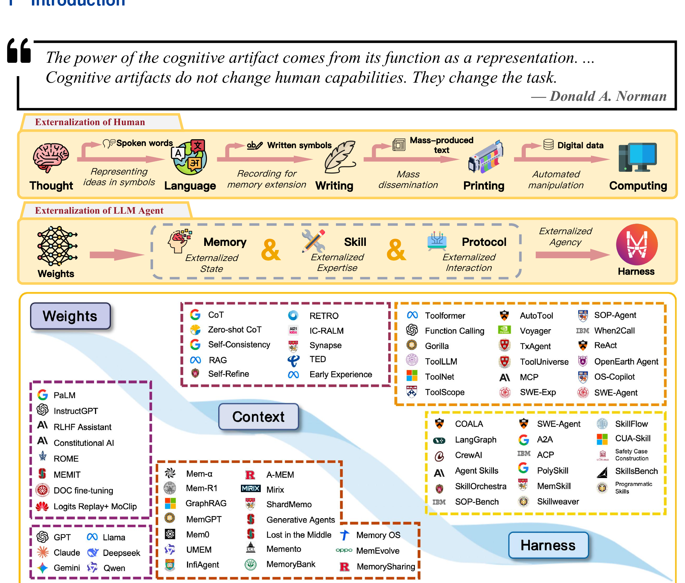
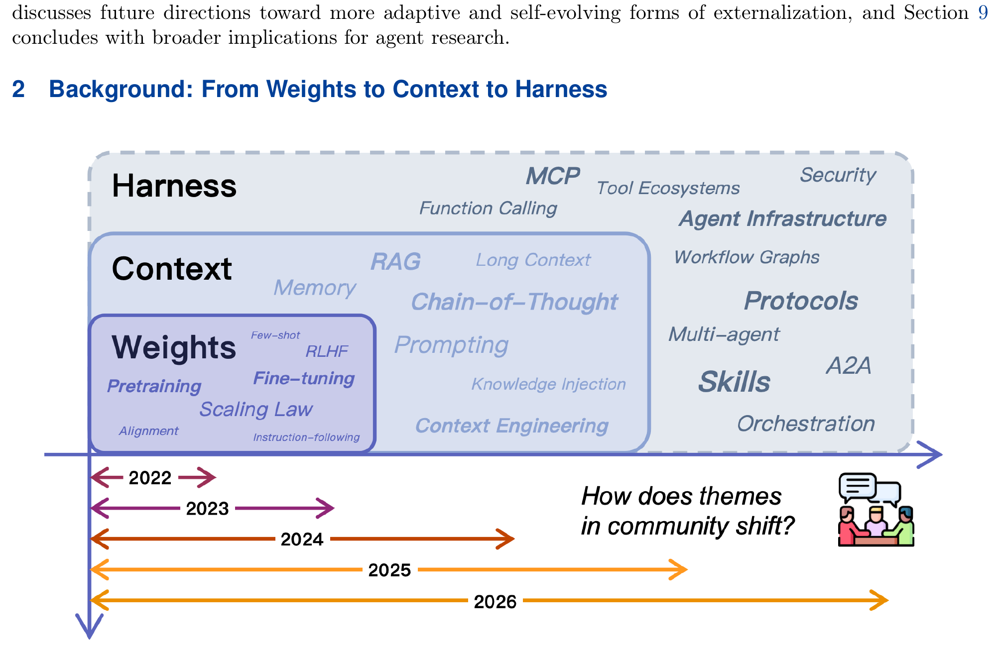
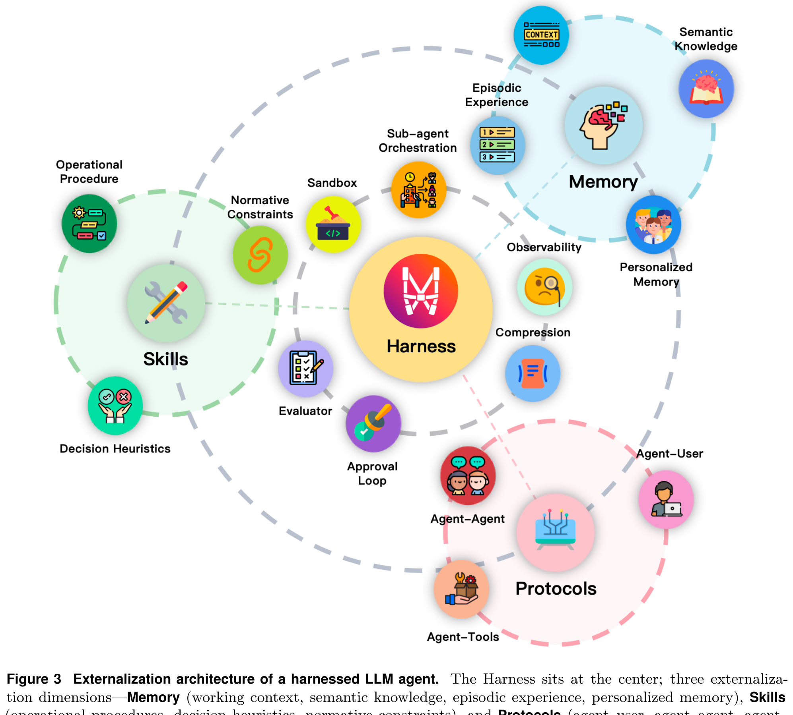
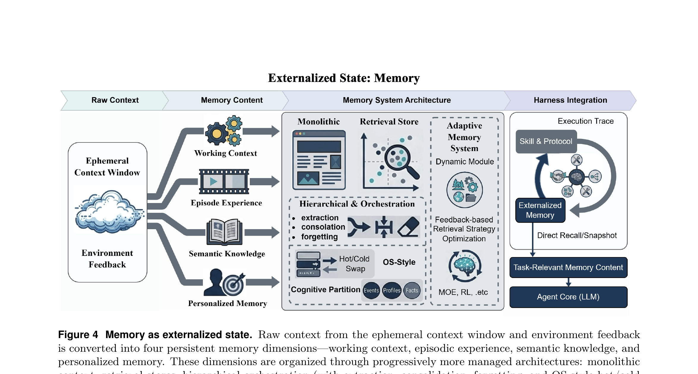
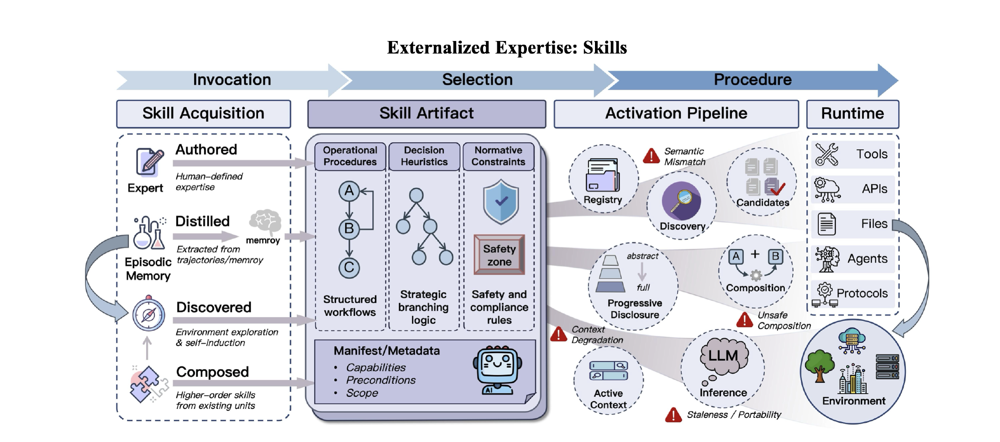
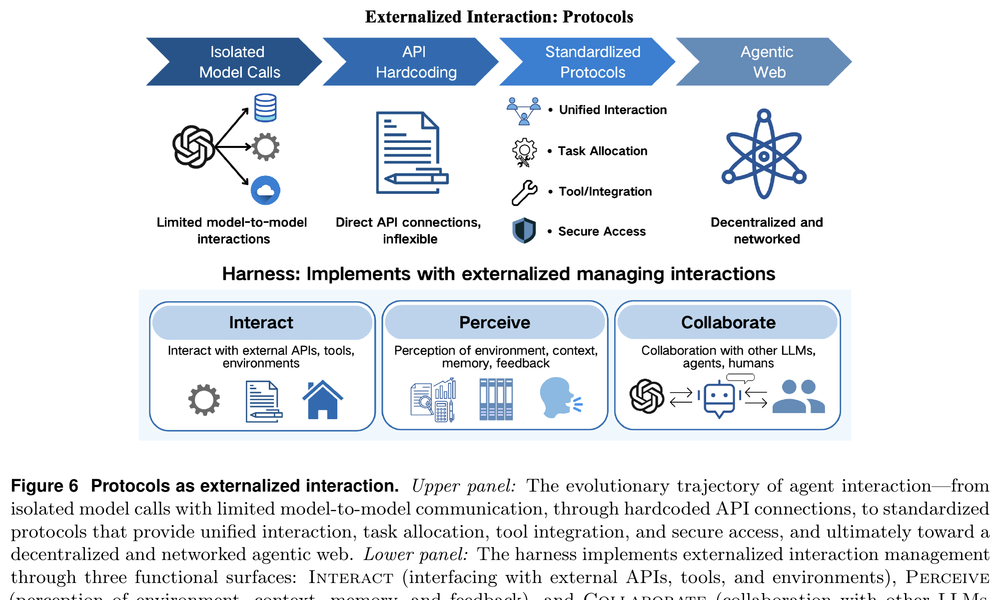
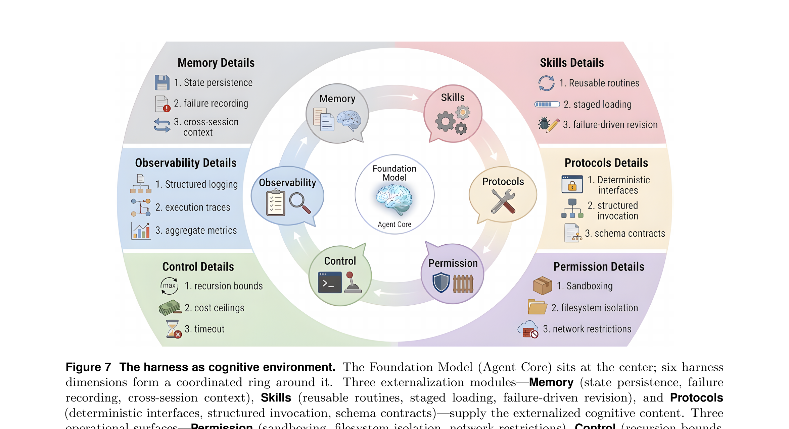
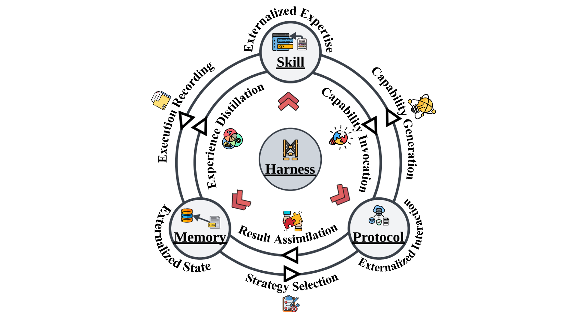

# Reading Notes: Externalization in LLM Agents

**Paper**: Externalization in LLM Agents: A Unified Review of Memory, Skills, Protocols and Harness Engineering  
**ArXiv**: 2604.08224  
**Authors**: Chenyu Zhou, Huacan Chai, Wenteng Chen, Zihan Guo, et al. (21 authors)  
**Affiliations**: Shanghai Jiao Tong University, Sun Yat-Sen University, Shanghai Innovation Institute, CMU, OPPO  
**Date**: April 10, 2026  
**Pages**: 54  

---
## 1. Introduction (pp.4-6)

**Core thesis**: LLM agent 的进步越来越不是靠改模型权重, 而是靠重组模型周围的运行时环境 (runtime). 以前期望模型内部恢复的能力, 现在被外化 (externalized) 到了 memory stores, reusable skills, interaction protocols, 以及协调这些模块的 harness 中.

**理论锚点**: Donald Norman 的 "cognitive artifacts" 概念 -- 外部辅助工具不是放大内部能力, 而是**改变任务的表征形式** (representational transformation). 购物清单把回忆问题变成识别问题, 地图把隐藏的空间关系变成可见结构.

**三个外化维度**:
- **Memory** -- 跨时间外化状态 (externalized state)
- **Skills** -- 外化程序性专业知识 (externalized procedural expertise)  
- **Protocols** -- 外化交互结构 (externalized interaction structure)
- **Harness** -- 统一协调层, 把三者整合成可靠系统

**Figure 1 (关键图)**: 上半部分画人类认知外化弧线 (思想 -> 语言 -> 文字 -> 印刷 -> 计算); 中间部分画 LLM Agent 对应的外化弧线 (Weights -> Memory/Skills/Protocols -> Harness); 下半部分是文献景观, 按 Weights / Context / Harness 三层映射.

**关键论点**:
1. 当代进步常被叙述为"更大模型 + 更好训练 + 更复杂推理链", 但实际上很多可靠性提升根本不来自改变模型本身, 而来自改变模型周围的环境: 持久化记忆, 组织可复用技能, 标准化工具接口, 约束/编排/路由执行逻辑.
2. 未被辅助的 LLM 面临三个反复出现的 mismatch: 
   - 上下文窗口有限 + session memory 弱/缺失 -> **continuity problem** (memory 解决)
   - 多步骤流程常被重新推导而非一致执行 -> **variance problem** (skills 解决)
   - 与外部工具/服务/协作者的交互脆弱 -> **coordination problem** (protocols 解决)
3. 具体例子: 一个 SWE agent 在大仓库中实现功能 + 跑测试 + 开 PR. 没有外化时, 模型必须把仓库结构/项目惯例/工作流状态/工具交互都塞进一个脆弱的 prompt. 有了外化, 持久化项目记忆提供上下文, 可复用 skill 文档编码惯例和工作流, 协议化的工具接口强制正确 schema, harness 排序步骤/验证输出/管理失败.

## 1. Introduction 续 (pp.6-7)

**三个外化维度的核心转变**:
- **Memory**: 从 recall 到 recognition -- agent 不再需要从潜在权重中重新生成过去知识, 而是从持久化可搜索存储中检索.
- **Skills**: 从 generation 到 composition -- agent 从预验证组件组装行为, 而非每次从零即兴创作.
- **Protocols**: 从 ad-hoc 到 structured -- 模糊的自由格式通信变成可互操作、可治理的交换.

**Harness 不是第四种外化**, 而是工程层: 提供编排逻辑、约束、可观测性、反馈循环, 让三种外化形式协调运作.

**维度间的交互**: 不能孤立看待. Memory 扩展可能与 skill loading 竞争稀缺的上下文预算; Protocol 标准化约束能力的打包方式; Skill 执行生成的 trace 后来变成 memory; Memory retrieval 影响哪些 skill 和 protocol 路径被选中.

---

## 2. Background: From Weights to Context to Harness (pp.7-11)

**Figure 2 (关键图)**: 2022-2026 社区主题演变的堆叠层图. Weights (底层, 2022为主) -> Context (中层, 2023-2024) -> Harness (顶层, 2025-2026). 三层不是互斥的, 即使在最重基础设施的系统中权重仍然重要, 但每个阶段改变了开发者投入工程精力的重心.

### 2.1 Capability in Weights (p.8)
- 最早期: 能力 = 权重. Pretraining 压缩统计规律/世界知识/推理习惯. Scaling laws 建立了参数量/数据量/损失之间的可预测关系.
- Fine-tuning (SFT) + RLHF + DPO 进一步塑造行为 (指令遵循/对话风格/拒绝/领域惯例).
- **优势**: 快速推理, 紧凑部署, 跨任务强泛化, 无需外部查找.
- **局限**: 知识/过程/策略紧密耦合到静态制品. 更新单个事实需要 retraining/knowledge editing, 有副作用风险. 无法审计行为原因. 个性化困难 -- 一套权重服务数百万不同用户, 参数层面无法区分.
- **关键限制**: agent 从单轮问答走向长期任务执行时, 权重内部的知识/技能/交互规则难以选择性更新/模块化组合/治理.

### 2.2 Capability in Context (pp.8-9)
- 注意力从模型修改转向**输入设计**. Prompt engineering 证明不改权重就能大幅改变行为.
- ReAct 把推理 trace 和工具动作交织在单生成循环中, 纯 prompting 就能产生 agent-like 行为.
- RAG 引入更系统的外化: 查询时动态注入外部文档到上下文.
- **Norman 视角**: "模型知道事实 X 吗?" (recall) -> "X 已在上下文中, 模型能用吗?" (recognition).
- **局限**: 上下文窗口有限/昂贵/噪声大; "Lost in the middle" 问题; 窗口扩大不等于不需要选择性策展; 上下文是临时的, 每个新 session 都是部分失忆的开始; 系统越复杂 prompt 组装越脆弱.

### 2.3 Capability through Infrastructure (pp.10-11)
- **Harness 层**: 当 context 饱和、prompt 模板笨重时, 工程注意力转向 "模型应在什么环境中运行".
- 可靠性依赖: 外部 memory stores, tool registries, protocol definitions, sandboxes, sub-agent orchestration, compression pipelines, evaluators, test harnesses, approval loops.
- **早期里程碑**: Auto-GPT / BabyAGI (2023) -> AutoGen / MetaGPT / CAMEL / Reflexion -> SWE-Agent / OpenHands -> Deep Research -> Voyager / LangGraph / CrewAI.
- **反复出现的模式**: 可靠性问题越来越多通过改变环境而非仅靠 prompting 来解决.

**Figure 3 (关键架构图)**: Harness 居中, 三维度环绕:

- **Memory** 圈: Working Context, Semantic Knowledge, Episodic Experience, Personalized Memory
- **Skills** 圈: Operational Procedures, Decision Heuristics, Normative Constraints
- **Protocols** 圈: Agent-Tools, Agent-Agent, Agent-User
- **Harness 操作元素**: Sandbox, Observability, Compression, Evaluator, Approval Loop, Sub-agent Orchestration

### 2.4 Externalization as the Transition Logic (p.11)
- 从 weights 到 context 到 harness 的路径就是 Norman 意义上的外化故事: 模型内部难以管理的负担被逐步移到外部显式制品中, 任务也相应被转变.
- 可变知识: weights -> retrieval systems -> runtime context (recall -> recognition)
- 可复用过程: 隐含习惯 -> 显式 skills (即兴生成 -> 结构化组合)
- 交互规则: ad hoc prompting -> protocols (模糊协调 -> 受治理的契约)
- 运行时可靠性: -> harness logic (约束/可观测/反馈循环被显式化)
- **LLM 擅长什么**: 灵活综合、对提供的信息进行推理; **不太可靠的**: 稳定的长期记忆、程序可重复性、与外部系统的受治理交互. 外化因此构建了一个更大的认知系统来替换而非修补模型.

---

## 3. Externalized State: Memory (pp.11-16)

Memory 外化解决 agency 的**时间负担**. 裸 LLM 必须在临时 prompt 中携带连续性/先验经验/用户特定事实/部分完成的工作. 跨 session/分支/中断时这变得昂贵且不稳定. Memory 将其外化为可写入/更新/检索的持久状态.

在 harnessed agent 中, memory 不仅是归档: 它提供可恢复执行的检查点, 可蒸馏出 skill 的 trace, 影响 protocol 路由的统计, 以及治理机制可检查的持久状态.

### 3.1 What Is Externalized: The Content of State (pp.11-12)

**Figure 4**: Raw Context (临时上下文窗口 + 环境反馈) -> 四种持久 Memory 内容 -> Memory 系统架构 -> Harness 整合.

**四层外化状态** (受人类记忆分类学启发):

1. **Working Context (工作上下文)**: 当前任务的活跃中间状态 -- 打开的文件、临时变量、活跃假设、部分计划、执行检查点. 变化快, 不外化则随上下文窗口重置而消失. Coding agent (OpenHands, SWE-style) 通过物化 drafts/terminal state/workspace artifacts 到 prompt 外来实现恢复.

2. **Episodic Experience (情景经验)**: 记录先前运行中发生了什么 -- 决策点、工具调用、失败、结果、反思. 不仅是归档, 检索到的 episode 可作为具体先例帮助 agent 避免重复已知错误, 并为后续抽象提供原材料. Reflexion 通过存储失败尝试的反思摘要使此模式显式化; AriGraph 进一步将陌生环境中的局部交互轨迹视为 episodic memory 来构建更广泛的世界模型.

3. **Semantic Knowledge (语义知识)**: 超越任何单个 episode 的抽象 -- 领域事实、通用启发式、项目惯例、稳定的世界知识. 与 episodic 的区别不仅是粒度, 而是**什么跨案例成立**. 当前最常见形式: knowledge bases 和 RAG 语料库. 长期趋势: agent 越来越多地从积累的轨迹中蒸馏语义指导, 而不仅依赖静态人工文档.

4. **Personalized Memory (个性化记忆)**: 关于特定用户/团队/环境的稳定信息 -- 偏好、习惯、反复出现的约束、先前交互. 不能混入 agent 的通用自我改进存储, 因为用户特定 trace 遵循不同的保留/检索/隐私规则. IFRAgent 从移动环境演示中建立用户习惯库; web agent 用外化 profile 推断隐式偏好; VARS 等对话系统在隔离的用户 memory 空间中存储跨 session 偏好卡.

**四层之间的关系**: 重复出现的程序性规律可能先作为 episodic trace 中的模式出现, 但一旦 harness 将其提升为显式可复用指导, 它们就不再是 memory 而属于 skill 层.

**整体看**: Memory 外化的不是单一同质数据库, 而是**多层抽象的连续性负担**. Working context 支持即时恢复; episodic 支持反思和恢复; semantic 支持抽象和迁移; personalized 支持跨 session 适应.

### 3.2 How It Is Externalized: Memory Architectures (pp.13-14)

核心设计问题: 如何将活跃推理与存储状态分离? 四种渐进的架构范式:

**3.2.1 Monolithic Context**: 所有相关历史/摘要直接放在 prompt 中. 透明、易原型、短任务效果好. 但容量不可扩展, 摘要漂移, 模型花费稀缺 token 同时携带历史和解决当前问题. 最重要的是: 状态随 session 消失, 无法积累持久经验.

**3.2.2 Context with Retrieval Storage**: 仅保留近期工作状态在上下文中, 长期 trace 存外部按需检索. 这是大多数实际 copilot/assistant/coding agent 的底层模式. 解决了容量问题, 但将 memory 质量变成了检索问题 -- 错误记录被检出则 agent 被干扰, 正确记录被遗漏则如同从未记住. GraphRAG 加入图结构和社区级检索; ENGRAM 压缩到潜在状态表示; SYNAPSE 用统一的 episodic-semantic 图上的扩散激活来恢复局部相关形式. 共同目标: 用更适合长期推理的表示替代扁平的相似度搜索.

**3.2.3 Hierarchical Memory and Orchestration**: 不是所有 trace 都值得同等的保留策略或检索路径. Mem0, Memory-R1, Mem-α 引入对提取/整合/遗忘的显式操作, 将 memory 从被动存储变成有管理生命周期的活跃资源. 两种解耦趋势:
- **时空维度的资源解耦**: 借鉴 OS 逻辑, memory 作为受管理的受限资源. MemGPT 和 MemoryOS 将热工作状态与冷长尾存储分离, 按任务需求跨层交换. 在固定上下文预算下获得更高有效容量.
- **认知功能维度的语义解耦**: 按功能/内容类型组织 memory. MemoryBank 和 MIRIX 分离事件/用户画像/世界知识; MemOS 区分显式和隐式记忆; xMemory 按主题层级构建. 目标不仅是分类, 而是在复杂任务条件下更精确的检索.

**3.2.4 Adaptive Memory Systems**: 超越人工设计启发式, 架构本身在运行时自适应. 两个方向:
- **动态模块**: MemEvolve 将 memory 生命周期分解为独立可演化的 encode/store/retrieve/manage 模块; MemVerse 维护短期缓存 + 多模态知识图, 周期性蒸馏碎片化经验为抽象知识.
- **基于反馈的策略优化**: MernRL 用非参数化 RL 更新检索行为; mixture-of-experts gating 动态路由查询; GAM 跨多轮交互精炼检索条件.

**阶段总结**: 从 storage 到 control 的主要转变. Monolithic context 解决存在性; retrieval stores 解决容量; hierarchical 解决组织; adaptive 开始解决策略. Memory 从 prompting 的被动附录变成 harness 控制面的一部分, 决定模型能有效处理什么.

### 3.3 Memory Demands of the Harness Eras (pp.14-15)

进入 Harness 时代, memory 不再是孤立的存储模块, 而是运行时协调连续性/程序复用/受治理交互的基底.

- Harness 环境要求 memory 系统**显式地将状态从上下文中分离**. 在极长任务中, 无限制的 session history 累积会导致模型失去 attention 追踪. InfiAgent 等框架提出**以文件系统为中心的状态抽象**, 倡导所有内容 (从高层计划到中间变量到工具输出) 都必须实时写入文件系统. 每个决策步骤, agent 不再读取冗长历史, 而是读取工作空间的策展快照和少量近期动作. 这是 memory 核心表征角色的 harness 层面表达: **不是在 prompt 中保存所有历史, 而是将当前状态物化为模型可操作的形式**.

- Memory 必须与 skill 系统整合但角色不同. Memory 存储先前执行的证据 (trace/outcome/failure/user-or-task-specific context). Skill 始于某些证据被提升为显式可复用过程. 方向相反: 每次 skill 执行产生新 trace 写回 memory. Memory 不是程序性指导本身, 而是后续可从中派生指导的证据基础.

- Protocol 耦合: 工具结果/审批/委托事件/外部状态转换通过协议化接口到达, 但仅在被规范化并写入持久状态后才成为 memory. 反过来, memory retrieval 可能影响选择哪条 protocol 路径. 成熟 harness 中, memory 和 protocol 通过受治理的读/写循环链接, 但概念上不同: **protocol 治理交换, memory 治理跨时间的持久性**.

- 多 agent 场景下, memory 的共享和治理变得强制性. 建立读/写权限、解决存储事实间的冲突、控制每个 agent 对共享知识的访问配额, 都需要类似 OS 的低层控制能力.

### 3.4 Memory as Cognitive Artifact (pp.15-16)

用 Norman 的认知制品理论和 Kirsh 的互补策略概念来诠释 memory 外化.

**核心论点**: Memory 外化改变的是**任务的结构**, 而不仅仅是增加了信息. 现代 LLM 是无状态生成器, 每次调用都从新鲜上下文开始. 短交互中这可以隐藏在 prompt 中, 但长期工作中成为结构性限制. 过去的尝试/部分完成的工作/用户特定事实/环境状态都不可能无成本/无漂移/无截断地活在上下文中.

**Memory 外化把内部 recall 问题转变为外部 recognition-and-retrieval 问题**: 模型不再需要回忆相关历史, 只需识别和使用 memory 系统已浮现的策展切片. 这与 Norman 分析的外部清单如何改变记忆本质紧密类比: 关键不是添加了额外信息, 而是认知任务的形式被重组了.

**检索质量比存储容量更重要**: 一个存储量大但检索弱的系统呈现错误的问题表征 -- 历史存在但任务未被转换. 相反, 一个存储适度但索引/摘要/上下文选择强的系统能让下游推理显著容易. Memory 的成功标准不是 "保存了多少" 而是 **"当前决策是否可读?"**

**Kirsh 的互补策略**: agent 不仅通过内部更好地思考来提升性能, 还通过重组外部环境来卸载认知工作. Memory 系统恰好实现了时间维度的这一策略: 让 harness 外化持久性/新鲜度管理/相关性过滤, 模型专注于解释和上下文判断.

**常见失败模式也可解释为表征设计失败**:
- 陈旧记忆误导当前 -> 过时的问题表征
- 过度抽象记忆丢失操作细节 -> 当前决策需要的信息缺失
- 过度具体记忆淹没 prompt -> 噪声降低了外化本该简化的 recognition 任务
- 有毒/冲突记忆污染推理 -> 嵌入错误前提

**总结**: Memory 不仅是扩展有效上下文的工程便利, 而是重塑 agency 时间负担的认知制品. 通过将无限 recall 转换为有限的、策展的检索, 它在每个决策点改变了模型面对的任务.

---

## 4. Externalized Expertise: Skills (pp.16-24)

Skill 外化解决 agency 的**程序性负担**. LLM 可能原则上"知道"如何解决任务, 但可靠执行仍需每次重构工作流/默认值/约束. 随任务长度/环境特异性/分支决策数增长, 这种负担表现为 variance: 跳过步骤、不稳定的工具使用、不一致的停止条件.

**表征转变**: 从重复综合到可复用过程. 不再要求模型每次从权重或 ad hoc prompt 重新生成任务特定 know-how, skill 系统将其打包为可发现/加载/修订/组合的显式制品. 这不仅扩展可用动作集, 更改变了模型面对的任务: 从发明工作流变为选择和遵循工作流.

**Figure 5 (关键图)**: Skill 完整生命周期 -- Invocation -> Selection -> Procedure:

- **Skill Acquisition** (四条路径): Authored (专家编写) / Distilled (从 episodic memory/轨迹提取) / Discovered (环境探索和自归纳) / Composed (从已有单元组合高阶技能)
- **Skill Artifact**: Operational Procedures + Decision Heuristics + Normative Constraints, 附带 manifest/metadata (能力声明/前置条件/范围)
- **Activation Pipeline**: Registry -> Discovery (语义匹配) -> Progressive Disclosure (分层加载) -> Composition (绑定到工具/文件/agent/协议)
- **Runtime**: Active context + LLM Inference, 受 boundary conditions 约束 (staleness/portability/context-dependent degradation/unsafe composition)

### 4.1 What is Externalized: Procedural Expertise (pp.17-18)

Skill 外化的是**程序性专业知识** -- 不是孤立的动作接口, 而是在反复出现的假设和约束下执行任务的可重复方式. 与 tools (暴露操作) 和 protocols (描述操作如何被调用) 不同, skills 编码**一类任务应如何被执行**.

三个耦合组件:

**4.1.1 Operational Procedure (操作过程)**: 复杂工作的任务骨架 -- 步骤分解、阶段、依赖、停止条件. 解决的是过程层面的不稳定 (跳步/错序/提前终止), 而非动作层面的无能. CoT 使中间推理显式化; ReAct 耦合推理与动作; 编排系统将反复模式打包为工程化工作流. 但这些早期方法缺乏**持久性** -- 过程存在于当前 run 中但尚不是可复用制品. Skill 系统通过将工作流结构变成可存储/修订/重新应用的东西来弥合这个差距.

**4.1.2 Decision Heuristics (决策启发)**: 过程定义骨架, 启发式治理分支处的行为. 真实任务不按固定管线展开 -- 工具会失败、观察有噪声、多个合理动作竞争. 外化启发式编码默认选择/升级规则/偏好排序, 减少模型在每个节点重新发现局部策略的推理开销, 也使行为更稳定. 启发式捕获**专家风格**: 先试什么、何时回退、什么证据足够、多条路径可行时偏好什么权衡.

**4.1.3 Normative Constraints (规范约束)**: 过程在什么条件下才算可接受 -- 测试要求/范围限制/访问限制/可追溯性期望/领域特定运营规则. 技术上有效的工作流可能仍不合规/不安全/不符合运营要求. 外化后, 约束从事后评估标准变成 skill 本身的一部分: 塑造前置条件、阻断不安全分支、要求中间验证、定义必须生成的证据. 在成熟系统中, skill 同时是**能力的载体和治理的载体**.

三者合起来: procedures 提供结构, heuristics 提供局部策略, constraints 提供可接受边界. 只有三者都充分指定时, skill 才真正可跨任务/上下文/运行复用. Skills 位于动作接口之上、在 memory 之旁: 它们外化的不是过去状态而是可重复的任务 know-how.

### 4.2 From Execution Primitives to Capability Packages (p.18)

Skill 系统从两个更早的发展下游演化而来: 可靠动作调用和大规模动作选择. 三个阶段:

**Stage 1: Atomic Execution Primitives**: 模型获得对原子动作单元的稳定访问 (structured tool invocation / function calling). Toolformer 等展示模型能学会何时调用工具、如何构造参数、如何整合结果. 成就是稳定访问原子动作, 但单元是动作原语而非 skill.

**Stage 2: Large-scale Primitive Selection**: 工具数量增长后问题从调用变为选择. Gorilla/ToolLLM/ToolNet/ToolScope/AutoTool 等展示模型能在大集合中检索/排序/动态选择. 关键进步是可扩展的动作选择, 但单元仍是工具而非过程. 即使多步行为出现, know-how 仍隐含在 prompt/参数中而非作为有界可复用制品外化.

**Stage 3: Skill as Packaged Expertise**: 核心问题不再是"能否调用/检索 API", 而是"完成一类任务所需的 know-how 能否被打包为可复用的能力单元". 基本单元不再是孤立工具调用, 而是以可复用程序性指导和执行结构为中心的高级制品. Program-based skill induction 将原语编译为高阶可复用技能; web 环境中交互轨迹可蒸馏为可复用 skill 库/skill API; computer-use 场景中 skill 被组织为参数化执行和组合图, 带检索/参数实例化/失败恢复. 关键转变是**表征性的而非仅是操作性的**: 能力不再仅作为工具/API 访问, 而是作为可加载/复用/跨任务组合的打包程序性知识.

### 4.3 How Skills Are Externalized (pp.19-20)

Skill 外化不止于写下指令. 关键问题是: 程序性专业知识能否以**可发现/可加载/可解释/可绑定/可运行时执行**的形式表示? 涉及表征层 (如何描述和界定 skill) 和运行时层 (运行时何时/如何加载/绑定到哪些工具/子 agent).

**4.3.1 Specification (规格)**: 外化始于规格层. 典型形式: SKILL.md / 指令文件 / manifest / 声明性规格制品. 描述 skill 做什么、适用场景、假设什么依赖、满足什么约束、在什么 I/O 条件下运行. 良好的规格至少覆盖五类信息: **能力边界、适用范围、前置条件、执行约束、示例 + 反例**. 通过结构化规格, skill 从非结构化 prompting trick 提升为有界的能力描述, 为发现/加载/版本控制/治理奠定基础.

**4.3.2 Discovery (发现)**: Skill 成为显式制品后自然引入注册和发现问题. Agent 不能为每个任务无差别加载所有可用 skill. 需要注册表 + 发现机制支持选择性检索. 发现不仅是问"能调用什么工具", 而是问**"哪块程序性专业知识适合当前问题"** -- 更高层的匹配问题, 需考虑主题相似度、任务复杂度、环境假设、操作约束、风险条件. Skill 仅被存储是不够的, 必须在现实任务条件下可被检索.

**4.3.3 Progressive Disclosure (渐进披露)**: 发现一个 skill 不意味着其全部内容应立即注入活跃上下文. 长上下文不能可靠转化为更好性能, 详细指令可能成为推理噪声. 因此采用分层加载策略: 最小层仅暴露 skill 名称 + 简短描述; 更深层暴露 manifest 级信息 (适用条件/前置条件/主要约束); 最深层才加载完整的详细过程/异常处理/示例/支持文件. 目的不仅是压缩文档, 而是**将"是否需要更多 skill 细节"变成运行时决策**, 使信息密度匹配当前任务复杂度. Claude Code 的 skill 系统是当前工业实现中这种设计的典型体现.

**4.3.4 Execution Binding (执行绑定)**: Skill 仍然是认知层描述, 除非与可执行动作连接. 实际任务完成依赖一个绑定过程: 将 skill 的自然语言/结构化规格翻译为当前环境中的具体操作. Skill 本身通常不是执行器 -- 必须绑定到更低层的运行时基底: 工具/文件/API/子 agent/协议端点/shell 命令/测试运行器. Tools 提供可执行操作; Protocols 治理操作描述和调用方式; **Skills 提供将它们组合成可重复任务完成的高级策略**. 没有这种解释和绑定过程, skill 原则上可读但实践中不可用. MCP 等 schema-based 接口通过使能力可发现/可调用且不将 skill 折叠到工具或协议本身来支持运行时绑定层.

**4.3.5 Composition (组合)**: Skill 系统的价值在 skill 可被组合时充分实现. 与原子工具不同, skill 可参与高阶结构化协调: 串行执行/并行分工/条件路由/子 skill 递归调用. 组合意味着 skill 不仅是供模型消费的文档, 而是 agent 架构内的**可调度运行时单元**. 更重要的是, 组合是**程序性专业知识的高阶复用**.

### 4.4 Skill Acquisition and Evolution (p.21)

Skill 获取是一个演化过程, 程序性知识通过四条路径被编写/提取/发现/重组:

- **Authored (编写)**: 最常见最稳定的路径. SKILL.md / AGENTS.md / 项目级指令文件 / 组织 SOP 模板 -- 都是人工设计的程序性能力包. 重要性不仅在初始能力, 更在支持迭代修订: 当 agent 反复展示失败模式时, 工程师可更新对应 skill 文档. 编写的 skill 文档不仅是描述性的, 也是操作经验逐步转化为可复用行为结构的实践界面.

- **Distilled (蒸馏)**: 从历史轨迹/实践 trace/存储经验中归纳提取. 当特定成功结构跨任务反复出现时, 系统可将其抽象为更稳定的程序性单元. Memory 保存经验, skill induction 提取其中的可复用结构. Skill Set Optimization 从子轨迹奖励中提取可迁移技能; MemSkill 展示某些 memory 操作可被重构为可学习/可进化的 skill.

- **Discovered (发现)**: 超越人工编写和事后蒸馏, agent 可通过环境探索自主发现新 skill. Voyager (Minecraft) 是经典案例: 探索/执行反馈/自验证/课程驱动任务选择共同产生不断增长的可执行代码 skill 库. PolySkill 通过从具体实现中分离抽象目标来提升 skill 泛化复用.

- **Composed (组合)**: 许多高级 skill 不是从零发明, 而是从已有低/中级 skill 组装. 一旦特定组合被反复验证为有效, 该组合本身可被打包为新的高级 skill, 产生层级化 skill repertoire 而非扁平列表.

**总体**: Skill 获取不是一次性设计步骤, 而是持续的编写/提取/发现/重组过程. 成熟 skill 系统的定义不是存储了多少指令, 而是**多有效地将经验转化为可复用外化专业知识**. 在 harnessed agent 中这是系统化的: memory 提供证据, evaluator 决定什么值得提升, 协议化的执行面确定候选 skill 能否实际部署.

### 4.5 Boundary Conditions (pp.21-22)

Skill 外化改善了复用和治理但不保证可靠性. 四类边界条件:

- **Semantic alignment (语义对齐)**: Skill 规格表达意图和指导 (自然语言/轻量结构), 实际执行依赖具体工具/API/环境约束. 模型可能按字面遵循 skill 措辞但偏离真实目标. SkillProbe 识别出现有 skill 市场中语义-行为不一致是根本缺陷. 关键困难不仅是"能否调用某外部能力", 而是"在当前任务解释下是否应该调用".

- **Portability and staleness (可移植性与陈旧)**: 即使 skill 内部一致, 跨环境有效性不能假定. 网站/API/依赖/工作流/运行时惯例的变化可能使 skill 误导或完全失效. SkillsBench 表明 skill utility 在不同领域和模型-agent 配置间差异巨大 -- 可移植性应被视为条件性经验属性而非外化的内在特征.

- **Unsafe composition (不安全组合)**: 单独无害的 skill 组合时可能不安全交互, 尤其当捆绑长指令/可执行脚本/外部依赖时. 公共 skill 生态系统的大规模实证研究报告了相当高的 prompt injection/数据外泄/权限升级/供应链风险率. 攻击导向研究进一步表明 skill 文件本身可成为真实的 prompt-injection 攻击面. **Skill 组合应被视为安全敏感过程而非纯粹良性的模块复用**.

- **Context-dependent degradation (上下文依赖退化)**: Skill 执行可能在长期交互中退化 -- agent 可能继续遵循过时的操作逻辑 (残留 session 上下文/缓存摘要/先前强化的动作模式). 同时, 详细 skill 指导注入过多局部程序性细节可能干扰全局任务追踪. Skill loading 因此不仅是检索问题, 也是**上下文分配和执行稳定性**问题.

**总结**: Skill 不是写好就自足的模块. 其有效性取决于与任务/环境/运行时条件/安全约束的持续对齐. 这正是 skill 设计最终指向 harness engineering 的原因.

### 4.6 Skills in the Harness (p.23)

Skill 在 harness 中通过四种耦合变得可操作:

- **Conditioning on memory**: Skill 根据检索到的状态被选择和参数化. Harness 查询 memory 获取任务历史/先前结果/用户特定上下文/环境约束, 据此决定加载哪个 skill/实例化哪些参数/偏好哪些分支. 没有这种调节循环, skill 选择退化为关键词匹配.

- **Binding through protocols**: 选定后, skill 必须接地到可执行动作. 通过协议化接口绑定: 工具 schema, 子 agent 委托契约, 文件操作, 审批工作流. Skills 和 protocols 互补: **skills 指定应做什么; protocols 指定结果动作如何被描述/调用/治理**.

- **Runtime governance**: Harness 对 skill 执行施加治理. 敏感操作前权限检查, 高风险步骤审批门, 加载了哪个 skill 及产生了什么动作的审计日志, 多步骤过程中途失败时的回滚机制. 这些控制不属于 skill 制品本身, 而是 skill 运行所在的 harness 环境的属性.

- **Lifecycle feedback**: Harness 闭合 skill 执行和 skill 演化之间的循环. 执行 trace/成功率/失败模式/用户修正写回 memory, 这些证据可能触发 skill 修订/废弃/新候选 skill 的提升. Harness 不仅托管 skill, 还提供 skill 改进的反馈基础设施.

### 4.7 Skill as Cognitive Artifact (pp.23-24)

**Norman 视角**: Skill 系统沿能力组织维度实现表征转换. 没有外化 skill 时, 模型必须在当前上下文压力下从内部参数概率性地恢复合适的执行方式. 有了外化 skill, 部分程序性负担被移到显式外部表征中, 任务从不稳定的潜在程序性 recall 转向更稳定的**识别适用指导并在其下行动**的过程. 这与 Norman 分析外部清单如何改变记忆本质紧密类比.

**Kirsh 的互补策略**: LLM 不特别擅长以稳定可重复的方式再现长多步骤过程 -- 同一 prompt 可能产生不同分解/分支决策/停止条件. 相比之下, 它们更擅长读取显式指导/匹配到当前上下文/在约束下适配执行. Skill 因此可被理解为**工程化的互补策略**: 将过程定义/约束/最佳实践部分外化到制品中, 让模型专注于解释/上下文匹配/异常处理.

**Skill 不仅仅是添加更多信息**: 它改变了能力如何被组织. 程序性专业知识从不透明的/难以审计的参数空间移到可检查/可修订/可组合的外部结构中. 在系统规模上, skill 通过将反复的工作流发明转化为选择/加载/运行时控制下的组合来外化程序性负担.

---

## 5. Externalized Interaction: Protocols (pp.24-29)

Protocols 外化 agency 的**交互负担**. 裸模型可能推断出应该调用工具/委托给子 agent/向用户展示响应, 但没有显式契约时, 它还必须即兴发明消息格式/参数结构/生命周期语义/权限/恢复行为. 这将每个外部动作变成脆弱的 prompt-following 练习.

**表征转变**: 从自由形式的交际推理到结构化交换. Protocols 提供类型化的 surfaces/状态转换/机器可读约束, 模型填充字段而非猜测语法. 它们不仅加速通信, 而是**将任务从协商 ad hoc 接口转变为在显式契约内运作**.

**Figure 6 (关键图)**:

- **上半部分**: 交互的进化轨迹 -- Isolated Model Calls -> API Hardcoding -> Standardized Protocols -> Agentic Web
- **下半部分**: Harness 通过三个功能面实现外化交互管理:
  - **Interact**: 与外部 API/工具/环境对接
  - **Perceive**: 感知环境/上下文/memory/反馈
  - **Collaborate**: 与其他 LLM/agent/人类协作

Protocols 外化的四个维度:
1. **Invocation grammar (调用语法)**: 工具调用/API 请求/委托消息需要格式 -- 参数名/类型/排序/返回结构. 外化为 schema 和类型化接口, 模型填字段而非猜语法.
2. **Lifecycle semantics (生命周期语义)**: 多步交互需要协调 -- 谁下一个行动/什么状态转换/任务何时完成或失败. 外化为显式状态机或事件流.
3. **Permission and trust boundaries (权限和信任边界)**: 真实世界 agent 动作受授权/数据流向/必须生成的证据约束. 外化为运行时可执行的可检查规则, 而非依赖模型自我约束.
4. **Discovery metadata (发现元数据)**: Agent 交互前需知道什么能力可用/如何到达. 外化为注册表/能力卡/schema 端点, 替代隐含在 prompt 中的知识.

### 5.1 Why Protocols Matter (pp.25-26)

三个维度的收益:
- **Unified interaction standards**: 给工具/agent/前端一个共享的发现/调用/交接/状态交换语法. 否则生态碎片化为局部方言.
- **Interoperability and composability**: 标准化使第三方工具/agent/服务可即插即用, 无需为每个新集成编写定制胶水代码.
- **Governance and auditability**: 当交互遵循显式协议时, 可以在协议层面施加/检查/执行安全和合规策略.
- **Reduced vendor dependence**: 开放交互契约在协议层而非提供商特定接口内积累能力, 模型/供应商/运行时组件可更低成本替换.

### 5.2 Agent Protocol Survey (pp.26-27)

按交互实体分类的协议家族:

**5.2.1 Agent-Tool Protocols**: 最早成熟的家族, 因为工具访问是接口碎片化最先出现的地方. **MCP (Anthropic, 2024)** 是最清晰的代表 -- 提供标准化方式让 agent 发现工具/检查 schema/跨异构服务调用. 解决的问题: 没有共享契约时, 每个新工具需要定制集成逻辑/重复 schema 定义/提供商特定适配. MCP 将工具访问变成基于协议的集成而非逐接口工程. 架构上, 服务器通过共同结构 (通常是 JSON-RPC 2.0) 暴露工具和上下文资源, 客户端执行发现和调用. 这解耦了工具生态与模型提供商特定的 function-calling 格式. 同样的分离也改善治理: 调用通过协议层中介, 敏感数据处理/权限检查/审计边界可以更显式管理.

**与相邻层的边界很重要**: MCP 及相关协议指定工具如何被描述和调用; 它们不指定应遵循哪个多步过程来使用这些工具 (那属于 skills), 也不自行保持跨 session 的认知连续性 (那属于 memory).

**5.2.2 Agent-Agent Protocols**: 多 agent 协作时, 交互本身成为系统问题. 
- **A2A (Google, 2025a)**: 最显眼的当前例子. 通过 Agent Cards 标准化能力发现, 支持面向任务的通信/状态更新/协商/异构 agent 间的流式进度. 核心价值: 使委托变得结构化 -- 调用方可发现对方提供什么/交接工作/追踪执行, 基于已知契约而非硬编码假设.
- **ACP (IBM Research, 2025)**: 强调轻量采用, 通过熟悉的 REST/HTTP 模式适配, 兼容性优先于丰富协商.
- **ANP (Chang et al., 2025)**: 推向相反方向 -- 去中心化身份/跨域发现/端到端安全通信, 瞄准开放 Internet 级互操作.

**5.2.3 Agent-User Protocols**: 形式化 agent 运行时和用户面系统之间的边界.
- **A2UI (Google, 2025b)**: 接口生成分支 -- 让 agent 在受约束的声明式格式中描述 UI 结构, 可跨平台安全渲染.
- **AG-UI (CopilotKit, 2025)**: 流式状态分支 -- 标准化执行事件类型 (运行开始/文本发射/工具调用参数/完成/错误), 前端可订阅事件流渲染运行时状态. 两个方向互补: A2UI 外化接口组合; AG-UI 外化其背后的活跃状态转换.

**5.2.4 Other Protocols**: 超越通用交互家族, 某些协议针对高风险垂直工作流:
- **UCP (Google, 2026)**: agentic commerce -- 标准化目录/请求/结账流程.
- **AP2 (Google Cloud, 2025b)**: 支付 -- 强调授权/签名/审计/防伪, 使用 IntentMandate/PaymentMandate/PaymentReceipt 等交易对象.
这些领域协议重要因为它们外化的是**工作流特定的治理**, 不仅是通用通信. 跨所有家族的共同模式: 协议将协调问题变得显式、可检查、可治理.

### 5.3 Agent Protocol in Harness Engineering (pp.28-29)

协议面如何嵌入运行中的 agent -- 三个 harness 表面:

**5.3.1 Intent Capture and Normalization**: 将模型产生的自然语言翻译为运行时可验证/执行的显式命令或事件. 自由文本提案被映射为协议对象, 对照当前上下文和权限边界检查, 不满足契约则被拒绝或修订. 这不移除模型判断, 但将交互的脆弱部分从潜在推理迁移到可检查接口, 提高长期执行的可靠性/治理/跨工具-agent-用户的更干净交接.

**5.3.2 Capability Discovery and Tool Description**: 旧系统中可用工具知识部分在 prompt/开发者假设中. 协议化发现用显式元数据替代: session 开始或阶段转换时, 运行时暴露当前可用工具/schema/输入输出结构. 双重效果: 减少上下文膨胀 (模型不需在 prompt 中携带所有工具契约); 使能力边界可治理 (权限/版本控制/审计可对照结构化元数据执行).

**5.3.3 Session and Lifecycle Management**: 长期 agent 不作为孤立单次调用运行. 运行时必须跨多轮/上下文窗口/执行阶段保持交互状态. 这里保持的不是持久 memory, 而是**协议状态**: 标识符/角色/待决动作/阶段转换/允许的下一步. 大多数长运行系统因此将执行视为带命名状态和转换规则的生命周期对象. 协议层推进该对象/发射状态变更/协调检查点或恢复事件. 当输出或检查点被写入持久存储时, 它们才成为 memory. 区分: **协议维持交互的连续性; memory 维持跨时间的连续性**.

### 5.4 Protocol as Cognitive Artifact (p.29)

**Norman 视角**: Protocol 沿交互维度实现表征转换. 没有协议时, 每个外部动作部分是自然语言推理问题: 模型必须推断意图操作/猜对格式/重构可接受约束/希望接收系统正确解释结果. 协议将开放推理替换为有界的结构化任务: 填写类型化字段/遵循声明的状态转换/接收结构化反馈. 模型仍需判断是否/何时行动, 但不再需要在每一步重新发明交互语法和语义.

这是外化最强的形式之一, 因为它从关键路径中**移除了整类推理**. 类似于 memory 对时间状态/skills 对程序性专业知识的转换, 但在不同维度运作: 不是要记住什么或如何进行, 而是**如何通信和协调**.

**Kirsh 视角**: LLM 擅长解释意图/在选项中选择/适配上下文, 但不擅长一致地产生格式良好的结构化输出. 协议实现互补分工: 模型贡献判断和意图, 协议面贡献格式/验证/生命周期控制. 两边单独都不够; 合在一起产生既灵活又有纪律的交互.

**Protocol 不可约化为 memory 或 skills**: Memory 外化学到了什么; skills 外化如何执行; protocols 外化 memory 和 skills 进入世界所通过的**纪律** -- 作为受治理的动作. Memory 需要受治理的读/写路径; skills 需要可绑定接口; 两者都依赖 protocols 跨系统边界以可检查/可审计/可恢复的形式运作. 协议因此不是次要管道而是使其他外化形式可运作的**表征性基础设施**.

---

## 6. Unified Externalization: Harness Engineering (pp.29-34)

**Figure 7 (关键图)**: Foundation Model (Agent Core) 居中; 六个 harness 维度形成协调环:

- 三个外化模块: **Memory** (状态持久性/失败记录/跨 session 上下文), **Skills** (可复用例程/分阶段加载/失败驱动修订), **Protocols** (确定性接口/结构化调用/schema 契约)
- 三个操作面: **Permission** (沙箱/文件系统隔离/网络限制), **Control** (递归边界/成本上限/超时), **Observability** (结构化日志/执行 trace/聚合指标)
- 箭头表示维度间的持续流动

### 6.1 What is a Harness? (p.30)

逐模块追求的外化改善局部能力, 但 agenthood 要求全局协调. Memory 积累经验但不指定哪些 trace 与当前任务相关; Skills 封装有效例程但不自动整合过去交互的教训; Protocols 规范化调用格式但不决定何时/在什么策略下应调用工具. 模块都在, 但**使它们联合有效的认知循环**仍欠指定.

"Harness" 这个术语近期作为描述将原始模型能力转化为可靠 agent 行为的脚手架而进入实践. OpenAI 围绕 Codex 的工程讨论明确使用该术语描述 agent loop/执行逻辑/反馈路径/周围操作机制.

**核心主张**: Harness 不仅是叠加在能力模型之上的实现便利, 而是外化模块在其中联合有效的**设计认知环境**. Foundation model 单独保留通用推理能力, 但缺乏决定它能访问什么/如何行动/动作如何被约束/行为如何被观测和修正的操作结构. Harness 提供该结构. Agency 因此不在模型中单独定位, 而是从**模型与组织其认知为行动的环境的耦合**中涌现.

### 6.2 Analytical Dimensions of Harness Design (pp.31-33)

六个反复出现的设计维度 (Figure 7 中的三个操作面各分解为两个):

**6.2.1 Agent Loop and Control Flow**: Harness 的时间骨架. 最简形式: perceive-retrieve-plan-act-observe 循环. 实际系统差异巨大: 单循环设计在一个生成 pass 中交织推理和行动; 层级设计将规划 agent 和执行器 agent 分离; 多 agent 设计将子任务路由到拥有不同工具集和权限范围的专家 agent. 
- Harness 在裸循环之上添加的是**终止/递归/资源消耗的治理**. 没有显式控制, agent 循环可无限运行/升级成本/递归到子 agent/耗尽计算预算. 生产 harness 强制最大步数限制/递归深度限制/每步成本上限/超时约束.
- **这些控制不是二级安全措施, 而是定义 agent 推理展开的操作信封**. 良好调优的循环让 agent 更可靠, 不是让模型更聪明, 而是通过限定可能执行路径的空间.

**6.2.2 Sandboxing and Execution Isolation**: Agent 作用于世界 (写文件/执行命令/调用外部 API) 时, harness 必须决定暴露多少环境/如何遏制非预期副作用. 
- Codex 风格: 每个任务在独立云沙箱中运行, 拥有自己的文件系统快照/网络限制/资源配额, 执行间不能互相污染.
- Claude Code 风格: 互补方案 -- 通过暴露渐进式权限模式 (从完全自主执行到每个工具调用的强制用户审批), 让同一 agent 在不同信任级别运行.
- **沙箱不仅是安全围栏, 也是认知边界**: 通过移除不相关状态/限制危险动作/使工作空间可检查, 改变了模型需要推理的内容.

**6.2.3 Human Oversight and Approval Gates**: 完全自主很少适合已部署 agent. 生产系统在 agent 循环中插入干预点, 人类可检查/批准/拒绝/重定向.
- 三种常见模式: Pre-execution approval (每个潜在后果性动作前暂停确认); Post-execution review (先执行后呈现结果供检查); Escalation triggers (正常条件自主运行, 检测到特定风险信号时暂停请求人类输入).
- **Hook 系统**将此模式泛化: 允许操作者将任意逻辑 (shell 脚本/验证检查/通知分发) 附加到 agent 循环中的特定生命周期事件 (工具调用/文件写入/子 agent 生成). 自主级别因此不是 agent 的二元属性, 而是 harness 的**可配置参数**, 按任务/按工具/按组织策略可调.

**6.2.4 Observability and Structured Feedback**: 不留下可检查 trace 的 agent 无法被调试/审计/改进. 可观测性是使 agent 内部轨迹对开发者/操作者/agent 自身可见的 harness 表面.
- 实现层面: 每次模型调用/工具调用/memory 读写/决策分支的结构化日志; 将每个动作链接到其因果前因的执行 trace; 步数/token 消耗/错误率/延迟分布等聚合指标.
- **对外**: 支持调试/合规审计/事后分析.
- **对内**: 闭合反馈循环 -- 失败的工具调用可触发 memory 写入记录失败上下文; 重复失败模式可标记某 skill 待修订; 延迟尖峰可触发 harness 切换协议路径.
- **可观测性不是辅助便利, 而是 harness 从自身运作中学习的机制**.

**6.2.5 Configuration, Permissions, and Policy Encoding**: Harness 必须编码的不仅是 agent 能做什么, 还有**在什么条件下允许做什么**. 需要将策略逻辑从执行逻辑中分离的配置层, 使治理规则显式/可版本化/可审计.
- 实践中典型的分层配置: 用户级 (个人偏好/信任边界) -> 项目级 (可用工具/可访问路径/需审批的命令) -> 组织级 (合规约束/成本上限/数据处理规则, 个别项目不能覆盖).
- 分层模型意味着**同一基础 agent 可在不同策略体制下运行**, 无需改变模型或加载的 skill artifacts. 权限和策略因此最好被理解为外化的治理: 原本需要嵌入 prompt 或通过事后过滤执行的约束, 改为作为 harness 在运行时执行的声明性规则编码.

**6.2.6 Context Budget Management**: 上下文窗口是任何 agent 系统中**最稀缺的共享资源**. Memory 检索/skill 加载/协议 schema/工具描述/模型自身的推理 trace 都竞争同一有限 token 预算.
- 有效策略: Summarization (压缩旧对话和执行历史为更短的决策相关表示); Priority-based eviction (移除/降级与当前子任务相关性已衰减的上下文条目); Staged loading (详细程序性指导仅在检测到匹配任务模式时才进入上下文, 而非从 session 开始就占预算).
- **Harness 联合编排这些策略**: 因为最优分配取决于当前执行阶段 -- 早期规划阶段可能需要更多 memory 和更少 skill 细节; 后期执行阶段可能相反. 上下文预算管理因此不是孤立的压缩问题, 而是**动态资源分配问题**, 需要 harness 根据 agent 的当前目标/正在使用的模块/运行约束来协调.

### 6.3 Harness in Practice: Contemporary Agent Systems (pp.33-34)

分析 OpenAI Codex 和 Anthropic Claude Code 作为当代生产 agent 系统的案例, 它们在产品表面/实现谱系/目标工作流上差异显著, 却收敛到惊人相似的 harness 结构集. 这种收敛是分析性显著的: 表明六个维度不是偶然的实现选择, 而是外化 agency 的**结构性需求**.

- **Loop and control flow**: 两者都围绕显式循环组织, 将模型推理与工具调用和环境观测交织, harness 与底层模型区分, 提供核心 agent 循环/执行逻辑/反馈路径. 关键: 循环包含显式终止控制 -- 步数限制/递归深度边界/资源上限.
- **Sandboxing**: 都实现不同粒度的执行隔离. Codex 风格在独立云沙箱中运行; Claude Code 暴露渐进式权限模式. 共同原则: 沙箱作为认知边界简化 agent 的操作环境.
- **Human oversight**: 都实现可配置的审批门控 -- hook 系统将验证逻辑附加到工具调用/文件写入/子 agent 生成等生命周期事件. 自主级别按任务/工具/组织策略可调.
- **Observability**: 都产生结构化执行 trace, 支持调试/合规/事后分析, 并闭合内部反馈循环.
- **Configuration and governance**: 都跨多层级分层配置, 权限和策略作为运行时声明性规则而非嵌入 prompt 的约束.
- **Context budget**: 都通过摘要/优先级逐出/分阶段加载主动管理上下文, harness 根据当前执行阶段编排分配.

**独立开发的系统收敛到相同的 harness 维度集这一事实本身就是指示性的**: 外化 agency 的首要设计挑战不是从模型中引出更好的完成, 而是安排使完成有效的操作条件. Harness engineering 因此既不是 memory 系统/也不是工具调用的重新品牌, 而是关注构建外化模块组合为连贯 agency 的**认知和操作环境**的更广泛学科.

### 6.4 Harness as Cognitive Environment (pp.34-35)

**超越软件工程意义上的基础设施**: Harness 不仅是支持已形成的智能, 而是通过决定推理展开的环境来**塑造 agent 的有效认知**. 它调控什么进入 agent 的感知域/什么跨轮次保留/哪些操作可调用/哪些中间状态暴露供修订/哪些失败形式可检测和恢复.

**Norman 的认知制品**: Harness 符合系统规模的描述. 它不仅仅是给模型更多上下文或更多工具; 它**重组任务的表征问题** -- 通过外化 memory/形式化 procedures/引入显式控制点/约束执行, 将无界任务转化为引导行动的结构化环境. 模型的表观智能因此改变, 不是因为它有了更多资源, 而是因为认知工作负载已被跨制品/表征/模型外的过程**重新分配**.

**Kirsh 的空间智能利用**: Harness 扮演类比角色 -- 信息/工具/权限/过程被安排得使理想行为更容易产生/不理想行为更难产生. 默认值/hook/文件边界/skill 调用模式/审查门控都作为结构化规律性, 缩窄合理行动的空间. Agent 的能力因此部分是**生态学成就**: 源自被嵌入一个环境, 该环境的组织将认知引导向生产性方向.

**分布式认知 (Hutchins, 1995)**: 该框架拒绝认知仅驻留在个体心智内的观点. 配备 harness 的 agent 系统精确地以这些术语可理解: 操作性智能分布在模型参数/外部 memory stores/可执行 skills/协议定义/工具表面/监控系统/治理运行时约束之间. Harness 是这个分布式系统被协调的媒介. 因此更准确的描述是: harness 作为认知环境而非仅作为基础设施层 -- 基础设施是其表现之一; **环境结构化 -- 设计认知展开的条件 -- 才是其更深的功能**.

---

## 7. Cross-Cutting Analysis (pp.35-39)

三个外化模块分析上不同, 但真实系统从它们的交互中获得力量. 本节检查模块在 harness 内的系统级耦合, 分析它们如何在模型边界处表现, 并考虑参数化与外化能力之间的边界应划在哪里.

### 7.1 Module Interaction Map (pp.35-37)

**Figure 8 (关键图)**: 三个外化模块和 Harness 之间的六条耦合箭头:

**六条模块间耦合流**:

1. **Memory -> Skill: Experience Distillation (经验蒸馏)**: 重复轨迹可被蒸馏为可复用过程. TED, UMEM 展示 episodic trace 如何被聚类/抽象/提升为 skill 制品, 无需修改基础模型权重. Voyager 在终身学习中保留成功行为为可复用代码级 skill. 跨维意义: memory 不仅保存过去, 还提供 harness 决定什么值得成为可复用操作模式的证据. 蒸馏步骤的质量 (什么泛化/什么是情境性的) 决定了整个 skill 层下游的可靠性.

2. **Skill -> Memory: Execution Recording (执行记录)**: 反向流. 每次 skill 执行生成 trace/中间失败/运行时微调, 否则随上下文窗口消失. 可观测性和日志基础设施将这些捕获为持久证据, 允许系统验证哪些 skill 保持可靠/哪些应修订/分割/约束. 成熟 skill 系统不能与 memory 管理分离: 可复用过程只有在其真实执行历史被持续写回 memory 时才保持可信. 否则蒸馏路径 (前一条流) 在越来越陈旧的证据上运作.

3. **Skill -> Protocol: Capability Invocation (能力调用)**: Skill 从抽象过程跨越到受治理动作的边界. 转换通过 protocols 发生: 高级意图被翻译为类型化调用/生命周期事件/权限检查的交互面. OpenClaw 的 "Lethal Trifecta" 分析表明: 即使程序性指导本身合理, 不受约束的执行仍然是安全问题 -- 协议级验证作为独立于 skill 自身正确性的边界检查.

4. **Protocol -> Skill: Capability Generation (能力生成)**: 接口标准化后, 编纂使用它的最佳实践变得大幅容易. OpenAPI 和 MCP 不仅使工具可调用, 还为系统提供了将接口特定 know-how 打包为可复用 skill 制品的足够结构规律性. 重要的不对称性: 协议标准化不仅消费 skills, 还**主动扩展可编写新 skill 的表面**. 每个新的稳定接口都是一族可复用过程的潜在种子.

5. **Memory -> Protocol: Strategy Selection (策略选择)**: 存储的上下文也影响 harness 选择哪条协议路径. 历史成功率/用户偏好/先前失败可决定请求应本地处理/调用外部工具/委托给另一个 agent. 多 agent 设置中尤其明显: harness 需在本地执行 (MCP)/工具调用/远程 agent 委托 (A2A) 之间选择. Memory 因此将协议选择从静态配置变为经验驱动的路由决策.

6. **Protocol -> Memory: Result Assimilation (结果同化)**: 每次协议交互产生必须被保存的状态 (否则将不成为 agent 持续认知的一部分). 工具输出/审批事件/错误载荷/委托结果以结构化响应 (比纯文本更丰富) 到达. Harness 必须将这些规范化到 memory 中, 使后续推理基于已验证的外部状态而非重构或幻觉的假设. 此流闭合循环: 协议层提供 memory 存储所条件化的证据, 进而影响新的 skill 选择和新的协议路由.

**系统级动力学** (三个重要涌现性质):
1. **自我强化循环**: 更好的 memory 使 skill 蒸馏更好; 更好的 skill 产生更丰富的执行 trace 改善 memory; 这种正反馈可加速能力增长, 但也可放大错误 -- 有毒 memory 条目导致有缺陷的 skill, 执行 trace 进一步污染 memory, 级联到无单一模块的质量控制能中断的程度, 需要 harness 级干预.
2. **上下文竞争**: 模块共享同一稀缺资源 -- 上下文窗口. 扩展一个模块的上下文足迹必然压缩其他模块. Harness 必须管理每步执行中的相对预算分配.
3. **时间尺度差异**: 协议交互通常快速同步; skill 加载在任务/子任务边界发生; memory 蒸馏和 skill 演化跨 session 展开. 优化快循环 (快速工具执行) 的 harness 可能忽略决定长期能力增长的慢循环. 有效 harness 设计需要平衡快循环的响应性与慢循环的连贯性.

### 7.2 The LLM Input/Output Perspective (pp.37-38)

从模型边界处 (上下文窗口和输出面) 看, harness 不是简单添加更多组件, 而是将进出模型的内容重组为功能上不同的层:

**输入侧三层**:
- **Memory as contextual input**: 塑造决策时可用的历史和情境信息. 检索机制选择状态/先前轨迹/实体关系的小切片, 而非将完整执行日志灌入. 选择质量直接决定模型是基于过去的准确图景还是扭曲图景进行推理.
- **Skills as instructional input**: 塑造给模型的程序性指导. 而非在单体 system prompt 中编码每个工作流, harness 仅在检测到相关任务模式时加载专门的指令/示例/约束. 模型因此更少从零发明工作流, 更多解释和遵循准备好的工作流.
- **Protocols as action schema**: 塑造输出边界. 通过强制 JSON schema/MCP 消息/OpenAPI 对齐的调用等结构化契约, 约束模型的生成空间, 使下游执行足够确定性可治理. 输出不再仅是待解释的语言, 而是置于显式接口内的机器可读动作提案.

**输入/输出分解的分析价值**: 它阐明了分工和失败分类法:
- **检索错误** 表现为输入选择错误: 模型推理正确但基于错误上下文
- **Skill 失败** 表现为程序性指导错误: 模型忠实遵循指令但指令本身有缺陷/不匹配
- **Protocol 失败** 表现为动作-schema 错误: 模型意图正确但输出违反接口契约
- Harness 使这些失败类别**可分离地调试/归因/独立优化** -- 多模块贡献到每个决策的系统中的重要属性.

**更广视角**: 模型边界处的三分组织 (上下文/指导/动作 schema) 可被理解为**结构化的上下文工程**形式. Harness 将 prompt 从无差别的文本缓冲区分离为具有不同更新率/治理需求/失败模式的层. 每层可独立修订: memory 检索可改进而不重写 skill; skill 制品可更新而不改变协议 schema; 协议面可扩展而不修改 memory 策略. 这种模块性是外化方法的主要实践优势之一.

### 7.3 Parametric vs. Externalized: The Trade-off Space (pp.38-39)

相关设计问题不是智能应驻留在模型内还是基础设施中, 而是**特定负担应在哪里生存**, 考虑其更新频率/复用模式/治理需求/执行成本. 结构化决策的五个维度:

1. **Update frequency and temporal decay (更新频率)**: 快速变化的知识/过程/环境状态是外化的强候选. 通过 continual fine-tuning 保持模型权重时效是灾难性遗忘风险且通常不切实际. 外部存储可立即更新并维护显式溯源和版本控制. 稳定的背景能力 (语言理解/广泛推理/常识推理) 更自然地以参数化方式携带, 受益于快速检索和与模型表征结构的深度整合.

2. **Reusability and multi-agent portability (可复用性)**: 跨任务/用户/agent 反复需要的能力从外化中获益更多 -- 显式 skill/脚本/接口制品可共享/版本化/跨异构运行时复用, 无需每个 agent 重新发现或重新训练. 一次性或高度特异性的行为可能不值得外化的打包/维护开销.

3. **Auditability, governance, and alignment (可审计性/治理)**: 当检查/审批/回滚/策略执行重要时, 外化制品有明显优势 -- 符号接口支持断路器/schema 验证/可追溯的执行记录, 权重不能. Fine-tuning (如 RLHF) 提供概率性行为塑造, 但外化约束在接口层提供确定性执行. 越是高风险的部署, 将治理逻辑外化到显式可检查形式的理由越强.

4. **Latency, simplicity, and context burden (延迟/简单性/上下文负担)**: 外化将计算和组织成本从模型的前向传播转移到周围系统 -- 检索/路由/解析/工具调用都引入延迟. 每个检索到的制品竞争有限的上下文预算, 过多的上下文加载可通过信息过载或 "lost in the middle" 现象降级性能. 对于超快/低 variance/纯语义的任务, 让模型依赖内部参数化知识往往更简单且更可靠.

**结论**: 结果不是模型智能和基础设施智能之间的零和竞争, 而是**系统分区问题**. 强 harness 将受益于持久性/复用/控制的负担外化, 同时让稳定/快速/通用的能力留在模型内. 最优分区不是静态的: 随着模型变得更强和外化基础设施变得更成熟, 边界将继续移动 -- §8.1 进一步探讨的动态.

---

## 8. Future Discussion (pp.39-44)

六个前瞻性问题:

### 8.1 The Expanding Frontier (pp.39-40)

模型内部与外部之间的边界不固定, 随模型/任务/基础设施共演化而移动:
- **向内拉**: 模型改进可使某些外化组件冗余. 能可靠产生结构化输出的模型减少 harness 中的格式验证需求; 更大有效上下文窗口可能容忍更简单的 memory 架构; 更强的内在工具使用能力可能减少精心设计的 intent capture 的需要.
- **向外推**: 更丰富的 harness 对模型提出新要求 -- 在结构化运行时中运作需要尊重 schema/配合权限检查/协调分阶段上下文注入. 前沿因此双向移动, 核心工程挑战是知道何时进一步外化/何时回撤.

**当前仍大量隐含、可进一步外化的认知工作类别**:
- **Planning and goal management**: 当前 agent 通常通过 in-context reasoning 生成计划, 产生临时分解, 上下文重置后丢失. 方向: 将计划物化为一等 harness 对象 -- 持久/可检查/可修订/跨 agent 和人类可共享. 这会将计划从瞬态推理行为转化为可管理的状态制品 -- memory 对历史上下文所做的同类表征转换.
- **Evaluation and verification**: 大多数评估逻辑目前生活在模型的思维链内部或事后运行的外部 benchmark harness 中. 将评估标准/rubric/验证过程外化为运行时 harness 组件, 让 agent 在执行过程中对照显式标准检查自身输出. 早期迹象: verifiability-first 工程框架和从 critique 中分离生成的 self-refine 循环.
- **Orchestration logic itself**: 最递归的外化形式 -- 使 harness 自身的配置/策略/执行逻辑成为 agent 可检查/修订的对象. 一旦编排逻辑被外化, agent 系统不仅能适配它知道什么和做什么, 还能适配它如何组织知行.

**Multi-modal externalization**: 到目前为止, 框架主要假设文本作为主要表征媒介. 随模型原生处理图像/视频/音频/屏幕内容, 每个外化维度面临新设计需求:
- Multi-modal skills 不仅编码文本过程还要编码视觉感知工作流和跨模态决策逻辑
- Multi-modal memory 需要索引和检索视觉/听觉经验
- Protocol schemas 需要扩展到多模态数据类型
- 意义: 这不仅是添加新数据类型, 而是为认知负担外化打开了一个实质上更宽的前沿

### 8.2 From Digital Agents to Embodied Externalization (p.40)

自然问题: 同样的架构逻辑是否延伸到具身系统 (必须感知/移动/物理交互)?

- **早期单体方法**: Vision-Language-Action (VLA) 模型作为端到端 "大脑", 类似于前外化 LLM agent
- **正在出现的分解**: 机器人学领域出现类似的模块化分解 -- 持久 memory 跨 episode/可复用 skill 库/硬件抽象层和安全约束形式的协议层
- 关键差异: 具身场景增加了**连续感知/物理安全/实时约束**的维度
- 方向: 具身外化可能最终与数字外化共享大部分架构词汇, 但需要额外的安全关键约束层
- **Cerebrum-cerebellum split**: 新兴架构将高级 robot agent (LLM/多模态模型) 定位为 "大脑皮层" 负责目标解释/任务分解/跨步骤状态维护/异常处理; VLA 模型重新定位为 "小脑" 负责单个原子操作原语 (抓取/放置/倒注) 的精确/快速/适应局部物理扰动的执行. 这直接映射到本文的外化维度.
- **收敛不是巧合**: 数字和具身 agent 面临同一根本张力 -- 单一模型不能同时优化慢速/深思/可检查的认知与快速/反应/低延迟的执行. 外化通过将每类认知工作路由到最适合的基底来解决这一张力.
- **具身挑战**: 物理动作不可逆 (掉落的物体不能 "回滚"); 实时控制的延迟预算比文本生成严格几个数量级; 感知有噪声; 模拟-真实差距仍然显著. 这些约束不改变外化的根本逻辑, 但深刻塑造 memory/skills/protocols 的设计.

### 8.3 Toward Self-Evolving Harnesses (pp.41-42)

当前大多数 agent 系统仍依赖人类来修订 memory 策略/重写 skill 制品/在失败后收紧执行逻辑. 如果编排逻辑本身也被外化 (如 §8.1 讨论), harness 就成为可以被程序性适配而非仅手动调整的对象.

**三个层次的自我演化**:
1. **Module level (模块级)**: 架构固定, 但内部策略 (检索粒度/skill 排名启发式/协议路由规则) 根据观察到的失败自动调整.
2. **System level (系统级)**: 执行管线本身被重组 -- 当日志揭示局部调优无法解决的反复瓶颈时, 调度策略/执行顺序/资源分配可能改变.
3. **Boundary level (边界级)**: Harness 的范围扩展或收缩 -- 当模型和任务变化时, 添加新的外化组件/修剪变得冗余的组件, 精确对应 §8.1 讨论的移动前沿.

**技术路径**:
- **RL**: 优化离散运行时策略 (搜索深度/压缩比/重试策略) 对抗任务成功/延迟/资源成本等奖励
- **Program synthesis**: 将 harness 适配视为代码修复 -- 模型在失败轨迹后提出补丁, 沙箱化测试验证后部署
- **Evolutionary methods**: 搜索 harness 拓扑 -- 模块如何连接/以什么顺序调用
- **Imitation learning**: 从人类专家或更强模型的执行日志中蒸馏更好的编排模式

**风险**: 自演化有吸引力因为它直接针对基础设施层面的失败模式, 但也放大了成本和风险 -- 适配性 harness 如果没有充分治理, 在适应新任务时可能降级旧任务, 累积的补丁可能遮蔽系统行为, 当人类监督减弱时优化目标可能被扭曲.

### 8.4 Costs, Risks, and Governance (p.42)

随认知负担向外移动, 两类成本累积: 外化基础设施本身的认知开销, 以及扩大的攻击面带来的安全风险.

**Cognitive overhead**: 外化不是免费的. 每层额外的 memory/API schema/安全规则都带来延迟和推理开销. 过了某个阈值, 模型花在发现/解析/协调模块上的精力比解决任务本身还多. 失败模式:
- Memory: 过度检索用边缘相关 trace 淹没上下文
- Skills: 冗长或重叠的 skill 文件竞争上下文预算, 导致模型遵循局部过程却失去全局目标
- Protocols: 工具蔓延使动作选择变成不必要的消歧问题
- 设计目标应是**高效且正收益**而非最大化外化. Minimal sufficiency: 某模块是否实际减轻了模型的认知负担还是仅仅增加了一个? Lazy loading / Budget-aware routing / Good harness simplifies (不创造第二个决策问题).

**Security and integrity risks**: 一旦认知和程序性负担迁移到外部制品, 那些制品就成为攻击目标, 威胁直接映射到三个 harness 维度:
- **Memory poisoning**: 通过损坏的 episodic trace 或事实存储静默扭曲未来推理
- **Malicious skill injection**: 在 agent 的可复用技能库中嵌入对抗性过程
- **Protocol spoofing**: 伪造工具 manifest 或操纵端点, 在合法交互外观下执行未授权操作
- 当外化变得自演化时风险复合: 适配新任务可能降级旧任务, 累积补丁遮蔽行为, 优化目标在人类监督减弱时可能被扭曲

**Governance as infrastructure**: 外化必须与治理配对设计而非事后追加. 关键更新的强制审查门/memory 和 skill 变更的溯源追踪/确定性回滚机制/回归测试 -- 都应成为基础设施的一部分. 外化系统的质量不仅由它能做什么衡量, 还由它多透明和多可逆地做到来衡量.

### 8.5 From Private Scaffolding to Shared Infrastructure (p.43)

到目前为止描述的外化主要是 agent 中心的: memory 服务一个 agent 的连续性, skills 作为本地包加载, protocols 通常限于框架内. 但随协作链拉长, 外化开始从私有脚手架向**共享基础设施**转变.

**Shared artifacts 跨三个维度出现**:
- **Shared memory**: 从 "我记得什么" 到 "我们知道什么" -- memory 变成共享状态/索引/共同基础的事务性系统
- **Shared skills**: 程序性专业知识变成可跨 agent/平台/组织复用/分叉/维护的公共能力单元
- **Shared protocols**: 提供使协调跨平台和组织互操作的共同语法

**Division of labor and collective learning**: 一旦结构可共享, agent 系统可分化角色而非每个都复制完整栈. 借鉴 stigmergy (群体智能中的间接协调), 失败轨迹可累积到共享 memory 中, 成功路径可结晶为共享 skills. 学习通过外部结构扩散而非仅通过联合参数训练.

**Institutionalization and its tensions**: 随 memory schema/skill 规格/protocol 绑定被反复验证, 它们开始更像制度而非临时脚手架 -- 协调生态规模行为的共享操作过程和标准. 但共享基础设施也引入新治理问题: 基础设施漂移/恶意或低质量制品/过早或延迟的标准化都可能破坏生态. §8.4 识别的治理成本因此在外化变得集体时被放大: 版本控制/权限审计/溯源/回滚成为 agent 系统制度设计的一部分.

### 8.6 Measuring Externalization (pp.43-44)

当前 benchmarks 主要通过固定 prompt 和固定模型设置下的任务完成来评估 agent. 这对比较基础模型能力有用, 但系统性地**低估外化基础设施的贡献** -- 一个通过更好 memory 检索/更精确 skill 加载/更紧执行治理提升可靠性的 harness, 只会表现为更高的 pass rate, 无法将收益归因到其真实来源.

**更丰富的评估议程应评估外化质量的多个维度**:
- **Transferability (可迁移性)**: 底层模型被替换时, 同一 harness 配置是否维持其有效性 -- 直接测试能力有多少驻留在外部基础设施 vs. 权重中
- **Maintainability (可维护性)**: 当 skills/memory 策略/protocol schemas 更新时, 系统退化有多优雅
- **Recovery robustness (恢复健壮性)**: Agent 能否检测失败/回滚部分动作/从检查点恢复
- **Context efficiency (上下文效率)**: 上下文预算中多少被 harness 开销消耗 vs. 任务相关推理
- **Governance quality (治理质量)**: 外化系统是否满足 §8.4 识别的透明性和可逆性要求

**具体评估策略**: 消融研究 (移除单个 harness 组件测量退化); 跨模型迁移测试 (固定 harness 变换模型); 长期可靠性指标 (跨多 session 交互追踪成功率/成本/漂移而非单轮完成).

**核心问题**: 在这些方法成熟之前, 该领域将继续把部分属于外化设计成就的东西归因于模型智能.

---

## 9. Conclusion (p.44)

**核心论证回顾**: 外化是连接 LLM agent 许多最重要发展的转换逻辑. 可靠 agency 越来越依赖将选定认知负担从模型中迁出到显式基础设施中:
- **Memory** 跨时间外化状态
- **Skills** 外化程序性专业知识
- **Protocols** 外化交互结构
- **Harness** 将这些层协调为工作运行时

从 weights 到 context 到 harness 的移动不仅是一系列工程技巧, 而是**agent 能力组织方式的转变**. 某些负担仍然适合以参数化方式处理, 但其他负担一旦被持久化/可检查/可复用/可治理地置于模型外部就变得更可靠.

**统一这些外化形式的是表征转换**: Memory 将 recall 变为 retrieval; Skills 将即兴生成变为引导组合; Protocols 将 ad hoc 协调变为结构化交换. 效果不是简单地在模型周围添加更多组件, 而是**改变模型被要求解决的任务**.

**前瞻性议程**: 关键问题不再仅是如何构建更强模型, 而是:
- 如何在模型和基础设施之间**分区能力**
- 如何**评估**外化系统的贡献
- 如何**治理** agent 越来越依赖的共享制品

**最终洞见**: Agent 的进步将来自模型与外部基础设施的**共演化**, 而非任何一方的孤立进步. 更好的 agent 不仅是更好的推理器 -- 它们是**更好地组织的认知系统**.

---

## Personal Reflections / Key Takeaways

1. **外化框架的解释力**: 用 Norman 的 cognitive artifacts + Kirsh 的 complementary strategies 作为理论锚点, 统一了 memory/skills/protocols/harness 这些原本看似独立的工程趋势. "不是添加更多组件, 而是改变任务的表征形式" 这个核心洞见非常有力.

2. **与 Chorus 的共鸣**: 论文描述的架构与 Chorus 的 AI-DLC 理念高度一致:
   - Chorus 的 Idea -> Proposal -> Task -> Execute -> Verify 流水线 = 外化的程序性 skill
   - Chorus 的 MCP session management = 协议层的 session and lifecycle management
   - Chorus 的 Agent Sessions (Swarm Mode) = harness 的 sub-agent orchestration + observability
   - Chorus 的 Activity Stream = harness 的 observability and structured feedback
   - "AI proposes, humans verify" = harness 的 human oversight and approval gates

3. **Skill 系统的实践启示**: Progressive disclosure (渐进披露) 的设计在 Claude Code 的 skill 系统中已经体现, 论文提供了更系统的理论框架. Skill 不仅是静态文档而是需要 specification/discovery/binding/composition 的完整生命周期管理.

4. **六条模块间耦合流**: 特别值得注意的是 Memory <-> Skill 的双向流 (experience distillation + execution recording) 和 Protocol -> Skill 的 capability generation 流. 这解释了为什么好的基础设施可以加速能力增长.

5. **评估差距**: 论文指出当前 benchmarks 系统性低估外化贡献是一个重要洞见. 当我们说 "model X 在 SWE-bench 上得分 Y%" 时, 很大一部分性能可能来自 harness 设计而非模型能力本身.

6. **安全警示**: Skill composition 的安全风险 (prompt injection/data exfiltration/privilege escalation) 和 memory poisoning 的级联效应值得认真对待, 尤其在 self-evolving harness 场景下.
